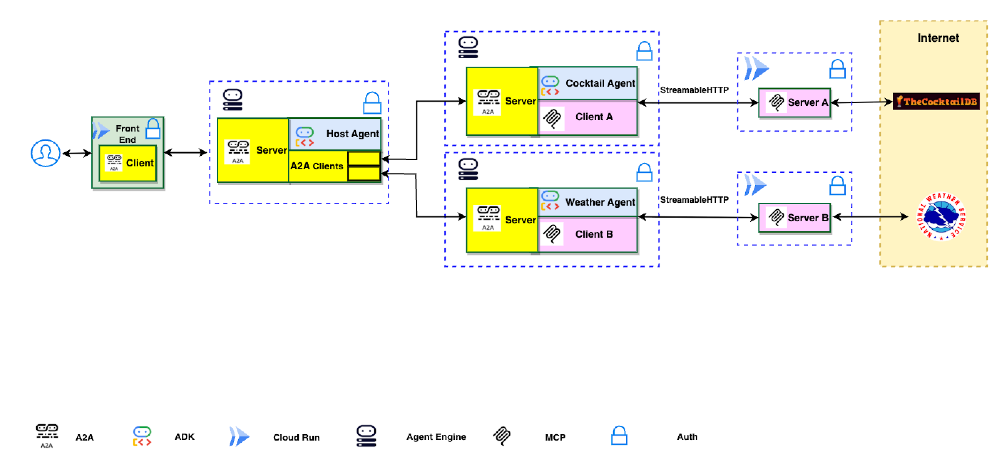
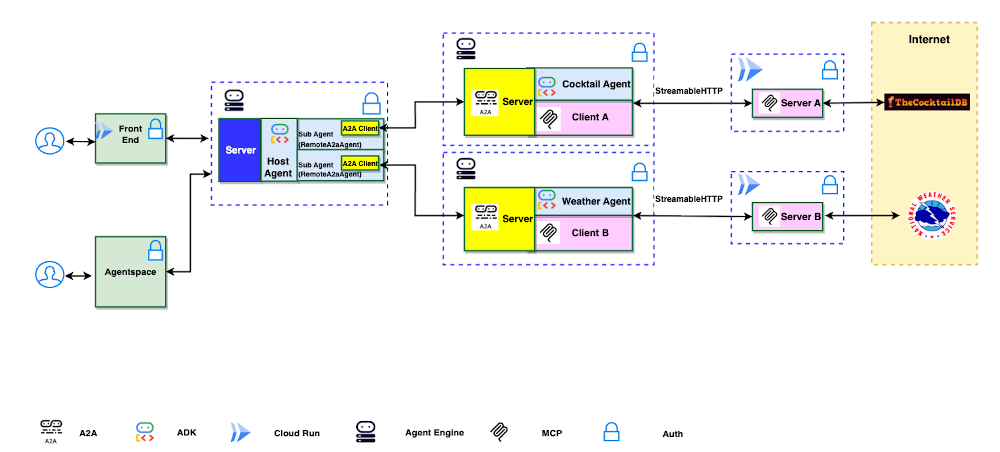
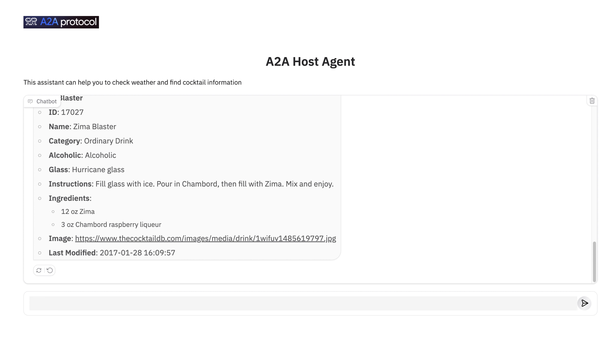

# A2A Multi-Agent on Agent Engine

> **⚠️ DISCLAIMER**: THIS DEMO IS INTENDED FOR DEMONSTRATION PURPOSES ONLY. IT IS NOT INTENDED FOR USE IN A PRODUCTION ENVIRONMENT.
>
> **⚠️ Important**: A2A is a work in progress (WIP) thus, in the near future there might be changes that are different from what demonstrated here.

This document describes a multi-agent set up using Agent2Agent (A2A), ADK, Agent Engine, MCP servers, and the ADK extension for A2A. It provides an overview of how the A2A protocol works between agents, and how the extension is activated on the server and included in the response.

## Overview

This document describes a web application demonstrating the integration of Google's Open Source frameworks Agent2Agent (A2A) and Agent Development Kit (ADK) for multi-agent orchestration with Model Context Protocol (MCP) clients. The application features a host agent coordinating tasks between specialized remote A2A agents that interact with various MCP servers to fulfill user requests.

### Architecture

The application utilizes a multi-agent architecture where a host agent delegates tasks to remote A2A agents (Cocktail and Weather) based on the user's query. These agents then interact with corresponding remote MCP servers.

**Option 1: Host Agent is built using A2A Server.**



**Option 2: Host Agent is built using Agent Engine server and ADK agents.**



### Application Screenshot



## Core Components

### Agents

The application employs three distinct agents:

- **Host Agent:** The main entry point that receives user queries, determines the required task(s), and delegates to the appropriate specialized agent(s).
- **Cocktail Agent:** Handles requests related to cocktail recipes and ingredients by interacting with the Cocktail MCP server.
- **Weather Agent:** Manages requests related to weather forecasts by interacting with the Weather MCP servers.

### MCP Servers and Tools

The agents interact with the following MCP servers:

1.  **Cocktail MCP Server** (Local Code)
    - Provides 5 tools:
        - `search cocktail by name`
        - `list all cocktail by first letter`
        - `search ingredient by name`
        - `list random cocktails`
        - `lookup full cocktail details by id`
2.  **Weather MCP Server** (Local Code)
    - Provides 3 tools:
        - `get weather forecast by city name`
        - `get weather forecast by coordinates`
        - `get weather alert by state code`

## Example Usage

Here are some example questions you can ask the chatbot:

- `Please get cocktail margarita id and then full detail of cocktail margarita`
- `Please list a random cocktail`
- `Please get weather forecast for New York`
- `Please get weather forecast for 40.7128,-74.0060`

## Setup and Deployment

### Prerequisites

Before running the application locally, ensure you have the following installed:

1.  [Python 3.12+](https://www.python.org/downloads/)
2.  gcloud SDK: [https://cloud.google.com/sdk/docs/install](https://cloud.google.com/sdk/docs/install)
3.  **(Optional) uv:** The Python package management tool used in this project. Follow the installation guide: [https://docs.astral.sh/uv/getting-started/installation/](https://docs.astral.sh/uv/getting-started/installation/)

### 1. Project Structure

Ensure your project follows this structure:

```bash
.
├── a2a_multiagent_mcp_app
│   ├── a2a_agents
│   │   ├── cocktail_agent
│   │   ├── hosting_agent_option1
│   │   ├── hosting_agent_option2
│   │   └── weather_agent
│   ├── frontend_option1
│   │   ├── Dockerfile
│   │   ├── main.py
│   │   ├── pyproject.toml
│   │   ├── README.md
│   │   ├── static
│   │   └── uv.lock
│   ├── frontend_option2
│   │   ├── Dockerfile
│   │   ├── main.py
│   │   ├── pyproject.toml
│   │   ├── README.md
│   │   ├── register_to_agentspace.sh
│   │   ├── static
│   │   └── uv.lock
│   └── mcp_servers
│       ├── cocktail_mcp_server
│       └── weather_mcp_server
├── asset
│   ├── a2a_ae_diagram.png
│   └── screenshot.png
├── main.py
├── pyproject.toml
├── README.md
└── uv.lock
```

### 2. Deploy MCP servers

Navigate to the `a2a_multiagent_mcp_app/mcp_servers` sub directories and follow the `README.md` file to set up the MCP servers on Cloud Run.

### 3. Deploy A2A Agents

Navigate to the `a2a_multiagent_mcp_app/a2a_agents` sub directories and follow the `README.md` file to set up the A2A agents on Agent Engine.

### 4. Run the Application

Navigate to either `a2a_multiagent_mcp_app/frontend_option1` or `a2a_multiagent_mcp_app/frontend_option2` and follow the `README.md` to run the application.

## Disclaimer

**Important**: The sample code provided is for demonstration purposes and illustrates the mechanics of the Agent-to-Agent (A2A) protocol. When building production applications, it is critical to treat any agent operating outside of your direct control as a potentially untrusted entity.

All data received from an external agent—including but not limited to its AgentCard, messages, artifacts, and task statuses—should be handled as untrusted input. For example, a malicious agent could provide an AgentCard containing crafted data in its fields (e.g., description, name, skills.description). If this data is used without sanitization to construct prompts for a Large Language Model (LLM), it could expose your application to prompt injection attacks. Failure to properly validate and sanitize this data before use can introduce security vulnerabilities into your application.

Developers are responsible for implementing appropriate security measures, such as input validation and secure handling of credentials to protect their systems and users.

## License

This project is licensed under the [MIT License](LICENSE).